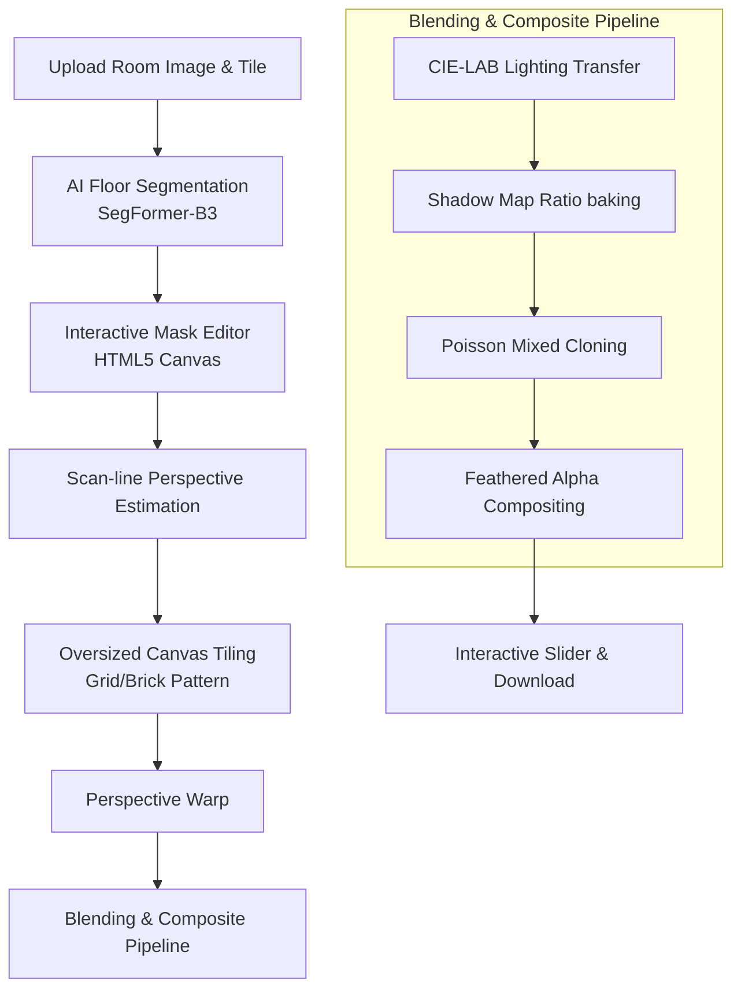

# 🏠 AI Floor Tile Visualizer

An end-to-end, AI-powered desktop web application that lets users upload a room photo and any tile/marble texture to see a photorealistic preview of their new floor in seconds. It uses state-of-the-art semantic segmentation, perspective-aware computer vision texture mapping, and physics-inspired image blending.

---

## 🚀 Quick Start

Get the application up and running instantly using our automation scripts:

### Windows (Single-Click)
Double-click the **`run.bat`** script in the project root. It will:
1. Detect Python and create a virtual environment (`.venv`).
2. Upgrade `pip` and install all required libraries from `backend/requirements.txt`.
3. Launch the FastAPI server and automatically serve the premium frontend on **`http://localhost:8000`**.

### macOS / Linux
Open your terminal in the project root and run:
```bash
chmod +x run.sh
./run.sh
```

---

> [!NOTE]
> **First Run Model Download:** The very first time you segment a floor, the Hugging Face library will download the `nvidia/segformer-b3-finetuned-ade-512-512` model (~47 MB) into your local cache. Subsequent runs are instantaneous.

---

## 🎨 Key Features

1. **AI-Powered Floor Segmentation**
   Uses the NVIDIA SegFormer-B3 Transformer model to detect floors, rugs, and carpets in diverse, complex lighting and perspective environments.
2. **Interactive Off-Screen Mask Editor**
   Refine the AI's mask using a real-time paint brush and eraser on a high-resolution HTML5 Canvas. Adjust brush size dynamically to handle tiny corners.
3. **Perspective-Aware Texture Mapping**
   Performs scan-line analysis on the floor mask boundaries to estimate the vanishing point and floor trapezoid, warping the tile texture dynamically to preserve realistic distance perspective.
4. **Seamless Lighting & Shadow Blending**
   * **CIE-LAB Lighting Transfer:** Shifts ambient color and matches light intensity to integrate tiles into the original room's ambient light.
   * **Shadow Map Preservation:** Bakes original cast shadows, reflections, and ambient-occlusion gradients back onto the tiled surface.
   * **Poisson / Mixed Cloning:** Performs gradient-domain blending to integrate tile boundaries and edges cleanly.
   * **Mask Feathering:** Smoothens the mask's boundary for clean transitions.
5. **Interactive Dual-Image Comparison Slider**
   Slide a draggable handle left and right to inspect the "before" and "after" composite side-by-side.

---

## 🛠️ Architecture & Pipeline Flow

The diagram below details how your room image and tile texture are processed into a photorealistic composite:



---

## 📁 Project Structure

```
floor-tile-visualizer/
├── backend/                  # Python FastAPI Backend
│   ├── app.py                # Server entry-point & routing
│   ├── pipeline.py           # End-to-end processing orchestrator
│   ├── segmentation.py       # SegFormer AI model loader & inference
│   ├── texture_mapping.py    # Vanishing-point & perspective warping
│   ├── blending.py           # Lighting transfer, shadow maps, Poisson cloning
│   ├── utils.py              # Base64 parsing, image resizing, and I/O
│   └── requirements.txt      # PyTorch, Transformers, OpenCV, FastAPI, etc.
├── frontend/                 # Premium HTML5/CSS3/Vanilla JS Client
│   ├── index.html            # App skeleton and layout
│   ├── style.css             # Premium glassmorphism dark-mode styles
│   └── script.js             # Canvas drawing, sliders, and API integration
├── .gitignore                # Environment and cache rules
├── run.bat                   # Automation startup script (Windows)
└── run.sh                    # Automation startup script (macOS/Linux)
```

---

## 💻 Manual Setup & Run Instructions

If you prefer to configure the project manually without scripts:

1. **Create and Activate a Virtual Environment:**
   ```bash
   python -m venv .venv
   
   # On Windows (cmd):
   .venv\Scripts\activate.bat
   
   # On macOS/Linux:
   source .venv/bin/activate
   ```

2. **Install Required Libraries:**
   ```bash
   pip install --upgrade pip
   pip install -r backend/requirements.txt
   ```

3. **Start the FastAPI Server:**
   ```bash
   cd backend
   uvicorn app:app --host 127.0.0.1 --port 8000
   ```

4. **Access the Web Interface:**
   Open your browser and navigate to `http://localhost:8000`.

---

## ⚙️ Core Technical Details

### 1. Segmentation Class Mapping
We map classes from the **ADE20K (150 classes)** dataset. After HuggingFace's image processor performs standard label reduction:
* **Class 3:** Floor / flooring
* **Class 28:** Rug / carpet / carpeting

These two classes are combined to isolate the floor region. We then apply morphological closing `(15x15)` and opening `(7x7)` filters to remove camera noise and bridge holes, keeping only contours larger than 1% of the total image area.

### 2. Vanishing Point / Perspective Projection
The scanline analyser (`estimate_floor_quad`) examines the vertical limits of the mask. By comparing the top 10% row boundary width and the bottom 10% row boundary width, we construct a trapezoid `[TL, TR, BR, BL]` in pixel coordinates. An homography matrix is computed using `cv2.getPerspectiveTransform` to project a perfectly tiled grid/brick pattern into 3D-space.

### 3. CIE-LAB Lighting Transfer
The LAB color space separates color (A/B channels) from luminance (L channel). The system computes the lighting distribution statistics (mean $\mu$ and standard deviation $\sigma$) of the original floor mask, then adjusts the tiled texture to match:
$$L_{new} = (L_{raw} - \mu_{raw}) \times \frac{\sigma_{orig}}{\sigma_{raw}} \times 0.70 + \mu_{orig}$$
This preserves the floor's overall highlights and ambient bounce while retaining the texture's native details.

### 4. Poisson mixed cloning
Uses the gradient-domain solver `cv2.seamlessClone` with `MIXED_CLONE` flags to blend the edges of the newly textured floor. It balances the original boundaries' color gradients with the tiled floor to prevent sharp border lines and make transitions look natural.

---

> [!TIP]
> **Recommended Input Formats:** For optimal perspective estimation, try uploading images where the camera is held at eye/chest level pointing slightly downwards toward the floor, with the bottom of the frame being entirely floor space.
